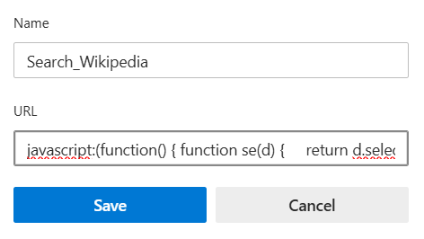

# 📸 Webpage Screenshot Bookmarklet

A handy browser bookmarklet to capture a full-page screenshot of any webpage using html2canvas. It provides an overlay view of the captured image with options to Download or Close the screenshot preview.

## 🚀 Features
- ✅ Full-page screenshot using html2canvas

- 🎯 Overlay preview with a movable image

- ⬇️ One-click download button

- ❌ Close button to exit screenshot mode

- 🧠 No extensions or setup required — just a bookmarklet!

## 📌 How to Install

1. Copy the following code:
   ```javascript
   javascript:(function(){function e(){if("undefined"==typeof html2canvas)return void alert("html2canvas library is required to capture the screenshot.");html2canvas(document.body,{onrendered:function(t){let n=document.createElement("div");n.style.position="fixed",n.style.top=0,n.style.left=0,n.style.margin="12px",n.style.display="flex",n.style.flexDirection="column",n.style.alignItems="center",n.style.justifyContent="center",n.style.border="1px solid #000",n.style.borderRadius="8px",n.style.padding="20px",n.style.background="#fff";let o=document.createElement("h1");o.textContent="Capture Screenshot",o.style.textAlign="center",o.style.color="#000",o.style.fontFamily="Arial, sans-serif",o.style.fontSize="16px",n.appendChild(o);let l=document.createElement("div");l.style.display="flex",l.style.gap="10px",l.style.flexDirection="row";let c=document.createElement("button");c.textContent="📸",c.style.padding="10px 20px",c.style.border="1px solid #000",c.style.borderRadius="8px",c.style.fontSize="16px",l.appendChild(c);let d=document.createElement("button");d.textContent="❌",d.style.padding="10px 20px",d.style.border="1px solid #000",d.style.borderRadius="8px",d.style.fontSize="16px",l.appendChild(d),n.appendChild(l),document.body.appendChild(n),d.addEventListener("click",function(){document.body.removeChild(n)}),c.addEventListener("click",function(){document.body.removeChild(n),r()});const r=()=>{let e=document.createElement("div");e.style.position="fixed",e.style.top=0,e.style.left=0,e.style.width="100vw",e.style.height="100vh",e.style.backgroundColor="rgba(0, 0, 0, 0.5)",e.style.zIndex=9999,e.style.cursor="pointer",e.style.display="fixed",e.style.position="fixed",document.body.appendChild(e);let n=document.createElement("button");n.textContent="Download Screenshot",n.style.position="fixed",n.style.top="10px",n.style.left="10px",n.style.padding="10px 20px",n.style.backgroundColor="blue",n.style.color="white",n.style.border="none",n.style.cursor="pointer",n.style.zIndex=1e4,document.body.appendChild(n),n.addEventListener("click",function(){let e=document.createElement("a");e.href=t.toDataURL(),e.download="screenshot.png",e.click()});let o=document.createElement("button");o.textContent="Close",o.style.position="fixed",o.style.top="10px",o.style.right="10px",o.style.padding="10px 20px",o.style.backgroundColor="red",o.style.color="white",o.style.border="none",o.style.cursor="pointer",o.style.zIndex=1e4,document.body.appendChild(o),o.addEventListener("click",function(){document.body.removeChild(e),document.body.removeChild(i),document.body.removeChild(n),document.body.removeChild(o)});let i=new Image;i.src=t.toDataURL(),i.style.position="absolute",i.style.top="50%",i.style.left="50%",i.style.transform="translate(-50%, -50%)",i.style.maxWidth="90%",i.style.maxHeight="90%",i.style.cursor="move",i.style.position="fixed",i.style.border="10px solid white",document.body.appendChild(i)};img.addEventListener("click",function(){let e=document.createElement("a");e.href=t.toDataURL(),e.download="screenshot.png",e.click()})}})}"undefined"==typeof html2canvas?((a=document.createElement("script")).src="https://cdnjs.cloudflare.com/ajax/libs/html2canvas/0.4.1/html2canvas.min.js",a.onload=e,document.head.appendChild(a)):e();})();

  
2. Open your browser bookmarks (in Chrome or Brave).

3. Add a new bookmark.(use shortcut Ctrl+D)

4. Paste the copied code into the URL field.

5. Name it something like: 📸 Screenshot Tool.
----

----

## 🧪 How to Use
1. Visit any webpage.

2. Click on the 📸 Screenshot Tool bookmarklet.

3. Wait for the image to render.

4. Use:

   - Download Screenshot button to save the image.

   - Close to exit the screenshot overlay. 
