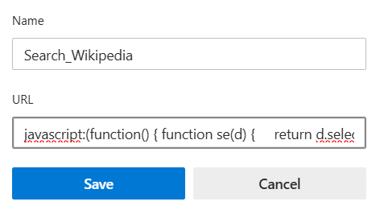

# 📸 Webpage Screenshot Bookmarklet

A handy browser bookmarklet to capture a full-page screenshot of any webpage using html2canvas. It provides an overlay view of the captured image with options to Download or Close the screenshot preview.

## 🚀 Features
- ✅ Full-page screenshot using html2canvas

- 🎯 Overlay preview with a movable image

- ⬇️ One-click download button

- ❌ Close button to exit screenshot mode

- 🧠 No extensions or setup required — just a bookmarklet!

## 📌 How to Install

1. Copy the following code:
   ```
      
   ``` 
2. Open your browser bookmarks (in Chrome or Brave).

3. Add a new bookmark.(use shortcut Ctrl+D)

4. Paste the copied code into the URL field.

5. Name it something like: 📸 Screenshot Tool.
----

----

## 🧪 How to Use
1. Visit any webpage.

2. Click on the 📸 Screenshot Tool bookmarklet.

3. Wait for the image to render.

4. Use:

   - Download Screenshot button to save the image.

   - Close to exit the screenshot overlay. 